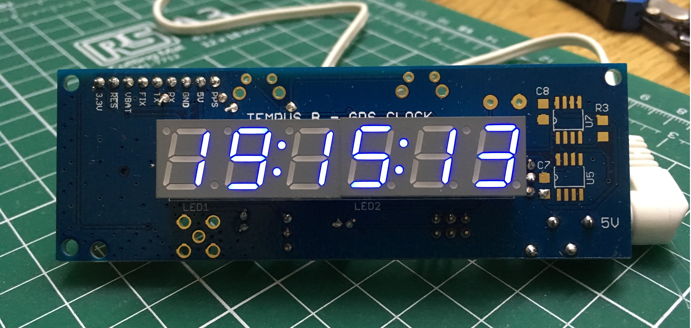
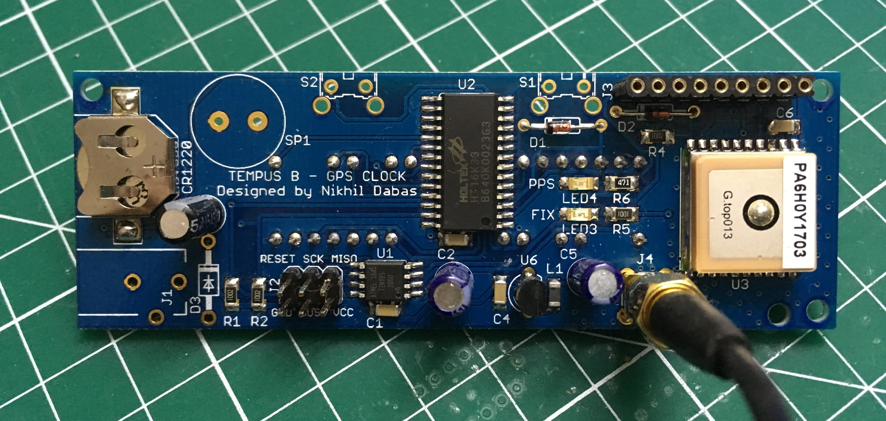

# Tempus B - GPS Clock

This project is a simple desk clock, synchronized to GPS using an on-board or external GPS receiver.

An ATtiny85 microcontroller runs the operation. Six 7-segment digits (in two 3-digit modules with colons) display the time. The display is controlled via an HT16K33 driver over I2C.

## Current Status

The hardware works. I got the boards fabricated by Elecrow, and everything looks good. I'm working on finalizing the software (which is currently written using Arduino.)

## Design

I used an ATtiny85 as a challenge in using the smallest possible (both in terms of memory and I/O pins) microcontroller while still maintining a high level of accuracy. The ATtiny has 8K of flash and 512 bytes of RAM. The design uses 5 I/O pins to receive serial data and PPS from the GPS module, and also control the display over I2C. The display controller also has keyscan built-in, so I use that to read two buttons for human interaction. There's also a little piezo speaker on board for beeps and boops.

I've used a mix of through-hole and SMD parts, partly to make construction easy and partly because I used whatever I had lying around.

The board has a footprint for the Global Top PA6H GPS module, as used in the [Adafruit Ultimate GPS v3](https://www.adafruit.com/product/746). There's a pin header as well to plug in the Adafruit board instead; you could use your own GPS module by connecting up the pins there. The board can work with 5V or 3.3V logic. All that's needed is the TX  and the PPS from the GPS module.